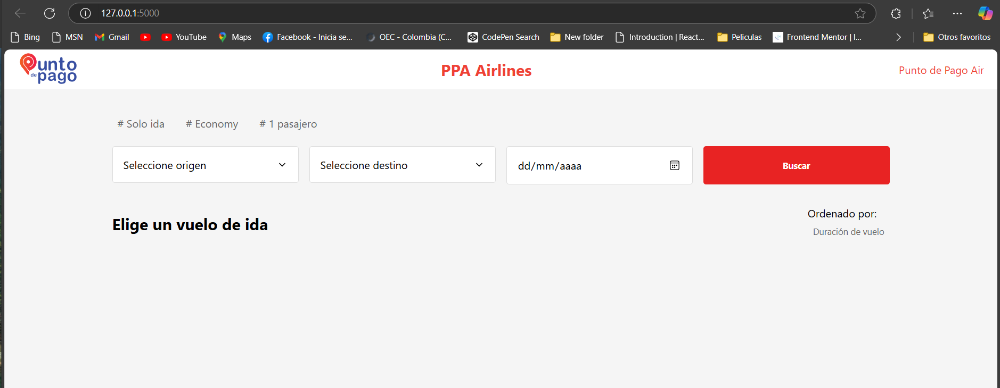
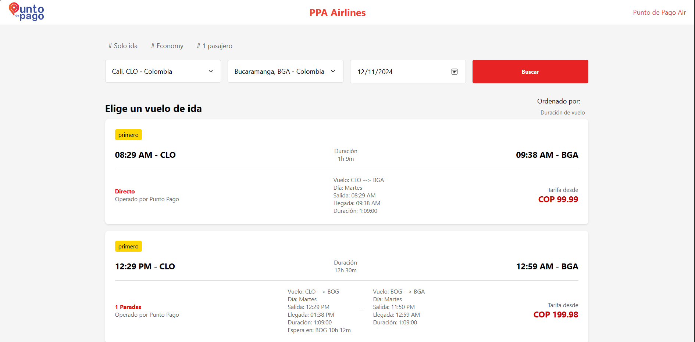

# Búsqueda de Vuelos con el Algoritmo de Dijkstra

**Descripción:**

Este proyecto implementa un algoritmo de búsqueda de rutas de vuelos utilizando el algoritmo de Dijkstra para encontrar las mejores alternativas de vuelos entre varios aeropuertos. El código permite ingresar parámetros obligatorios como el código del aeropuerto de origen, el código del aeropuerto de destino y la fecha de búsqueda, mientras que también ofrece  opcionales como el tiempo máximo y mínimo de espera entre escalas.


---

**Observación:**


El código está optimizado para manejar tiempos de transbordo de menos de 24 horas, dando prioridad a las conexiones más cercanas. En caso de que existan opciones de transbordo en días posteriores, estas serán ignoradas si hay rutas disponibles en días cercanos que cumplan con los requisitos. Esto asegura que se maximicen las conexiones rápidas, evitando esperar demasiado tiempo entre vuelos.


---

**Parámetros Requeridos:**

1. **Código de Aeropuerto de Inicio** (origen): El código del aeropuerto de partida (por ejemplo, "BOG, MDE, BAQ, BGA, SMR, CTG, CLO y EOH").
2. **Código de Aeropuerto de Destino** (destino): El código del aeropuerto de llegada (por ejemplo, "BOG, MDE, BAQ, BGA, SMR, CTG, CLO y EOH").
3. **Fecha de Búsqueda**: La fecha de inicio de la búsqueda de vuelos.

---

**Parámetros Opcionales:**

- **Tiempo Máximo de Espera entre Escalas**: Tiempo máximo permitido entre vuelos consecutivos. Se debe ingresar en formato "HH:MM". Valor predeterminado: `13:00` (13 horas).
- **Tiempo Mínimo de Espera entre Escalas**: Tiempo mínimo permitido entre vuelos consecutivos. Se debe ingresar en formato "HH:MM". Valor predeterminado: `00:40` (40 minutos).

---

## **Instrucciones de Uso:**

1. **Clonar el Repositorio:**
   Para comenzar, clona el repositorio en tu máquina local:

   ```bash
   git clone https://github.com/Imbana/Busqueda-Vuelos-Algoritmo-Dijkstra.git

2.  **Una vez clonado el repositorio, navega al directorio del proyecto:**
    ```bash
        cd Busqueda-Vuelos-Algoritmo-Dijkstra

3.  **Instalar Dependencias**
    ```bash
        pip install -r requirements.txt 
    
4.  **Configuración de Parámetros en main.py**
    ```bash
    #Parametros del fronted   Código del aeropuerto de origen  - Código del aeropuerto de destino -  Fecha de la consulta

    search_date =  datetime.now().replace(year=2024, month=11, day=11, hour=0, minute=0)  # Fecha de la consulta
    origin_airport_code = "BOG"   #  origen
    destination_airport_code = "BGA"  # destino


    #Parametros del sistema -  Tiempo mínimo entre conexiones (40 a 60 mintos en promedio) - Tiempo máximo  que se permite entre conexiones (ejemplo 13 horas)

    min_connection_interval: timedelta = timedelta(minutes=40)  # Tiempo mínimo 
    max_connection_interval: timedelta = timedelta(hours=24) # Tiempo máximo 
    
    
5.  **Ejecuta el siguiente comando en tu terminal:**
    ```bash
        python main.py

Salida

=== Ruta 1 ===  

Duración total: 1:09:00    
Vuelo : BOG -> BGA       
Día: Lunes   
Salida: 23:50   
Llegada: 00:59   
Duración: 1:09:00    


****
En el archivo database.py, se almacenó una lista de diccionarios, donde cada diccionario representa un vuelo. Esta estructura permite que los datos de los vuelos sean fácilmente gestionables y, a futuro, puedan ser almacenados en una base de datos para facilitar su manejo y consulta.
****


## **Interfaz Web**
Para facilitar la interacción con el sistema a través de una interfaz web, se ha creado un archivo index.html, el cual se expone mediante Flask. Si deseas ver la funcionalidad en un sitio web, debes ejecutar la aplicación Flask.

El diseño de la interfaz se basó en el sitio web de Latam debido a limitaciones de tiempo.


1.  **Ejecuta el siguiente comando en tu terminal:**
    ```bash
        python run.py 

2.  **En la terminal, se mostrará el puerto en el que se está ejecutando el servidor. Generalmente, la aplicación estará disponible en http://127.0.0.1:5000/  abrir la url en un navegador.**






